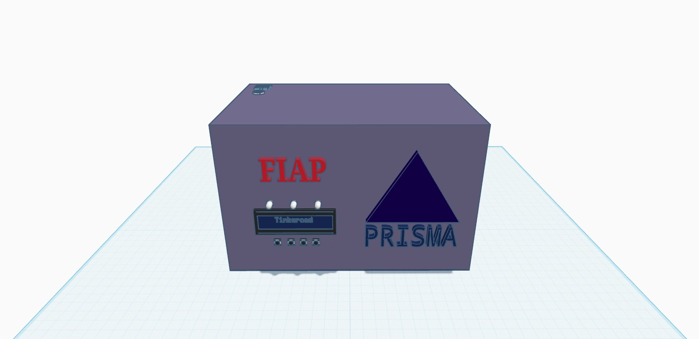
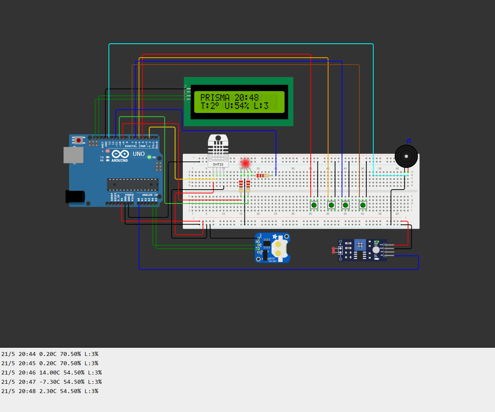

# 🍷 PRISMA — Monitoramento Ambiental para Adegas

> Sistema de monitoramento de temperatura, umidade e luminosidade com alertas em tempo real, display LCD e registro em EEPROM. Desenvolvido para a Vinheria Agnello.

| | |
|---|---|
|  |  |

---

## 📋 Sumário

- [Funcionalidades](#-funcionalidades)
- [Componentes](#-componentes)
- [Pinagem](#-pinagem)
- [Bibliotecas](#-bibliotecas)
- [Como Usar](#-como-usar)
- [Telas do Display](#-telas-do-display)
- [Alertas](#-alertas)
- [Log EEPROM](#-log-eeprom)
- [Limites Monitorados](#-limites-monitorados)

---

## ✅ Funcionalidades

- Monitoramento contínuo de temperatura, umidade e luminosidade
- Display LCD 16x2 I²C com 4 telas navegáveis por botão
- Relógio em tempo real RTC DS1307 exibido na tela principal
- LED RGB com cor dinâmica conforme status do ambiente
- Buzzer com alertas sonoros diferenciados por nível de criticidade
- 4 botões físicos para navegação e controle da tela de boas-vindas
- Log automático na EEPROM com timestamp, temperatura, umidade e luminosidade
- Buffer circular de 50 registros com sobrescrita automática
- Tela de boas-vindas animada com efeito de cores — ativável e desativável pelo botão, estado salvo na EEPROM
- Ícones customizados no LCD: termômetro, gota d'água e lâmpada com 3 níveis cada

---

## 🔧 Componentes

| Componente | Especificação |
|---|---|
| Microcontrolador | Arduino Uno R3 |
| Sensor de Temp./Umidade | DHT22 |
| Sensor de Luminosidade | LDR com resistor pull-down 10kΩ |
| Display | LCD 16x2 com módulo I²C (endereço `0x27`) |
| Relógio | RTC DS1307 |
| LED | LED RGB cátodo comum |
| Alerta sonoro | Buzzer passivo |
| Botões | 4× push-button (pull-up interno) |

---

## 📌 Pinagem

### Sensores e Atuadores

| Componente | Pino |
|---|---|
| DHT22 — Dados | D2 |
| LDR — Saída analógica | A0 |
| LED RGB — Vermelho | D9 (PWM) |
| LED RGB — Verde | D10 (PWM) |
| LED RGB — Azul | D11 (PWM) |
| Buzzer | D13 |

### Botões

| Botão | Pino | Função |
|---|---|---|
| BTN_WELCOME | D4 | Liga/desliga tela de boas-vindas |
| BTN_TEMP | D5 | Exibe tela detalhada de Temperatura |
| BTN_UMID | D6 | Exibe tela detalhada de Umidade |
| BTN_LUZ | D7 | Exibe tela detalhada de Luminosidade |

> Conecte um terminal do botão ao pino e o outro ao GND. Nenhum resistor externo é necessário — o código usa `INPUT_PULLUP`.

### Barramento I²C (LCD + RTC)

| Sinal | Pino |
|---|---|
| SDA | A4 |
| SCL | A5 |

> O LCD e o RTC compartilham o mesmo barramento I²C em paralelo nos pinos A4 e A5.

### Circuito do LDR

```
5V ── LDR ──┬── A0
            │
          10kΩ
            │
           GND
```

---

## 📦 Bibliotecas

Instale via **Sketch → Include Library → Manage Libraries**:

| Biblioteca | Autor |
|---|---|
| DHT sensor library | Adafruit |
| LiquidCrystal_I2C | johnrickman |
| RTClib | Adafruit |
| Wire | Nativa do Arduino IDE |
| EEPROM | Nativa do Arduino IDE |

---

## 🚀 Como Usar

### 1. Monte o circuito
Siga a pinagem acima. Verifique a polaridade do LED RGB e o resistor de 10kΩ no LDR.

### 2. Instale as bibliotecas
Instale todas as bibliotecas listadas acima via Library Manager.

### 3. Faça o upload
1. Abra o arquivo `codigo.cpp` no Arduino IDE
2. Selecione a placa em **Tools → Board → Arduino Uno**
3. Selecione a porta em **Tools → Port**
4. Clique em **Upload**

### 4. Primeira inicialização
Na primeira vez que o Arduino liga após o upload, a EEPROM está em estado de fábrica (`0xFF`) e a tela de boas-vindas é ativada automaticamente. O nome **PRISMA** aparece com animação de cores no LCD.

### 5. Operação normal
Após a inicialização o display entra na tela padrão:

```
PRISMA  14:32
T:13° U:68% L:25
```

### 6. Monitoramento via Serial Monitor
Abra o Serial Monitor com baud rate **9600** para ver os logs gravados em tempo real:

```
21/5 20:44 13.40C 68.20% L:25%
```

---

## 🖥️ Telas do Display

### Tela Padrão (sempre visível)
```
PRISMA  14:32
T:13° U:68% L:25
```
Linha 1: nome do sistema + hora atual (RTC). Linha 2: resumo dos 3 sensores.

### Tela de Temperatura — BTN_TEMP (D5)
```
Temp: 13.4°C [🌡]
Status: OK
```
Ícone varia: termômetro vazio (frio) → médio (OK) → cheio (quente). Volta à tela padrão após 5 segundos.

### Tela de Umidade — BTN_UMID (D6)
```
Umid: 68.2% [💧]
Status: OK
```
Ícone varia: gota vazia (seco) → média (OK) → cheia (úmido). Volta à tela padrão após 5 segundos.

### Tela de Luminosidade — BTN_LUZ (D7)
```
Luz: 25% [☀]
Status: OK
```
Ícone varia: lâmpada simples (OK) → com raios (alerta) → intensa (alta). Volta à tela padrão após 5 segundos.

### Botão Welcome — BTN_WELCOME (D4)
Alterna a tela de boas-vindas entre ativado e desativado. O estado é salvo na EEPROM e persiste após desligar o Arduino.

---

## 🚨 Alertas

### Tudo OK — Verde
Todos os valores dentro dos limites ideais. LED verde contínuo. Buzzer silencioso.

### Atenção — Amarelo
Algum valor saiu dos limites ideais mas ainda dentro da margem tolerável.

| Indicador | Comportamento |
|---|---|
| LED RGB | Amarelo piscante |
| Buzzer | Bipe curto (300ms, 250Hz) |

Condições:
- Temperatura < 12°C ou > 14°C
- Umidade < 60% ou > 80%
- Luminosidade > 40%

### Crítico — Vermelho
Valores ultrapassaram a margem de tolerância.

| Indicador | Comportamento |
|---|---|
| LED RGB | Vermelho contínuo |
| Buzzer | Tom contínuo (500Hz) |

Condições:
- Temperatura < 10°C ou > 16°C
- Umidade < 50% ou > 90%
- Luminosidade > 60%

---

## 💾 Log EEPROM

### Estrutura de cada registro (10 bytes)

| Offset | Tipo | Conteúdo |
|---|---|---|
| +0 | `long` (4 bytes) | Unix timestamp (RTC) |
| +4 | `int` (2 bytes) | Temperatura × 100 |
| +6 | `int` (2 bytes) | Umidade × 100 |
| +8 | `int` (2 bytes) | Luminosidade (0–100%) |

### Configuração do buffer

| Parâmetro | Valor |
|---|---|
| Endereço inicial | byte 10 da EEPROM |
| Máximo de registros | 50 |
| Tamanho por registro | 10 bytes |
| Total ocupado | 500 bytes |

O buffer é circular — ao atingir 50 registros, sobrescreve o mais antigo. Um registro é gravado **uma vez por minuto**, somente quando há anomalia ativa.

---

## 📊 Limites Monitorados

| Grandeza | Mínimo Ideal | Máximo Ideal | Crítico |
|---|---|---|---|
| Temperatura | 12°C | 14°C | < 10°C ou > 16°C |
| Umidade | 60% | 80% | < 50% ou > 90% |
| Luminosidade | — | 40% | > 60% |

> Os limites são definidos como constantes no código e podem ser ajustados conforme o ambiente.

---

## 📁 Estrutura do Projeto

```
Projeto_VinheriaAgnello/
├── imagens/
│   ├── modelo3d.jpeg   # Modelo 3D da caixa (Tinkercad)
│   └── circuito.png    # Circuito montado no Wokwi
├── codigo.cpp          # Código principal
├── Encapsulamento...   # Projeto do Modelo 3D
└── README.md           # Este arquivo
```

---

## 👥 Equipe

Projeto desenvolvido pela equipe **PRISMA** — FIAP.

---

## 📝 Licença

Distribuído sob licença MIT. Livre para uso, modificação e distribuição.
